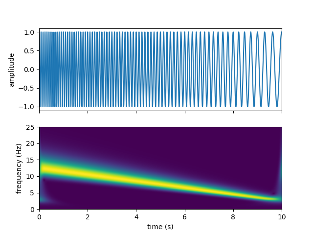
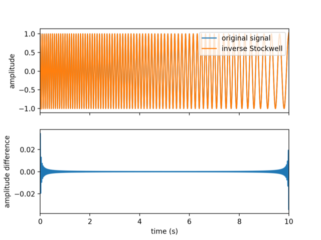

# Stockwell

Python package for time-frequency analysis through Stockwell transform.

Based on original code from [NIMH MEG Core Facility].

[NIMH MEG Core Facility]: https://kurage.nimh.nih.gov/meglab/Meg/Stockwell.


## Installation

### Using pip and PyPI (preferred method)

The latest release of Stockwell is available on the
[Python Package Index](https://pypi.org/project/stockwell/).

You can install it easily through `pip`:

    pip install stockwell


### Installation from source

If no precompiled package is available for you architecture on PyPI, or if you
want to work on the source code, you will need to compile this package from
source.

To obtain the source code, download the latest release from the [releases
page](https://github.com/claudiodsf/stockwell/releases), or clone the GitHub
project.

#### C compiler

Part of Stockwell is written in C, so you will need a C compiler.

On Linux (Debian or Ubuntu), install the `build-essential` package:

    sudo apt install build-essential

On macOS, install the XCode Command Line Tools:

    xcode-select --install

On Windows, install the [Microsoft C++ Build Tools].

[Microsoft C++ Build Tools]:
https://visualstudio.microsoft.com/visual-cpp-build-tools

#### FFTW

To compile Stockwell, you will need to have [FFTW](http://www.fftw.org)
installed.

If you use Anaconda (Linux, macOS, Windows):

    conda install fftw

If you use Homebrew (macOS)

    brew install fftw

If you use `apt` (Debian or Ubuntu)

    sudo apt install libfftw3-dev

#### Install the Python package from source

Finally, install this Python package using pip:

    pip install .

Or, alternatively, in "editable" mode:

    pip install -e .


## Usage

Example usage:

```python
import numpy as np
from scipy.signal import chirp
import matplotlib.pyplot as plt
from stockwell import st

t = np.linspace(0, 10, 5001)
w = chirp(t, f0=12.5, f1=2.5, t1=10, method='linear')

fmin = 0  # Hz
fmax = 25  # Hz
df = 1./(t[-1]-t[0])  # sampling step in frequency domain (Hz)
fmin_samples = int(fmin/df)
fmax_samples = int(fmax/df)
stock = st.st(w, fmin_samples, fmax_samples)
extent = (t[0], t[-1], fmin, fmax)

fig, ax = plt.subplots(2, 1, sharex=True)
ax[0].plot(t, w)
ax[0].set(ylabel='amplitude')
ax[1].imshow(np.abs(stock), origin='lower', extent=extent)
ax[1].axis('tight')
ax[1].set(xlabel='time (s)', ylabel='frequency (Hz)')
plt.show()
```
You should get the following output:



You can also compute the inverse Stockwell transform, ex:

```python
inv_stock = st.ist(stock, fmin_samples, fmax_samples)
fig, ax = plt.subplots(2, 1, sharex=True)
ax[0].plot(t, w, label='original signal')
ax[0].plot(t, inv_stock, label='inverse Stockwell')
ax[0].set(ylabel='amplitude')
ax[0].legend(loc='upper right')
ax[1].plot(t, w - inv_stock)
ax[1].set_xlim(0, 10)
ax[1].set(xlabel='time (s)', ylabel='amplitude difference')
plt.show()
```



## References

Stockwell, R.G., Mansinha, L. & Lowe, R.P., 1996. Localization of the complex
spectrum: the S transform, IEEE Trans. Signal Process., 44(4), 998–1001,
doi:[10.1109/78.492555](https://doi.org/10.1109/78.492555)

[S transform on Wikipedia](https://en.wikipedia.org/wiki/S_transform).
