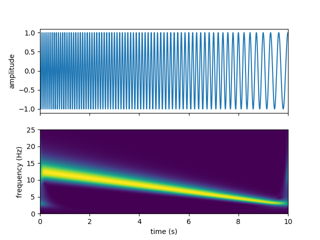
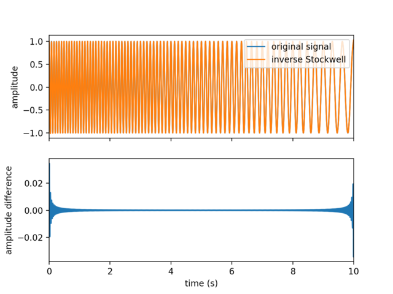

Examples
========

This page reproduces the example from the `README`_.

Forward Stockwell Transform
---------------------------

The following code generates a linear chirp, computes its Stockwell
transform, and plots the time series and the resulting time-frequency
spectrum:

.. code-block:: python

    import numpy as np
    from scipy.signal import chirp
    import matplotlib.pyplot as plt
    from stockwell import st

    t = np.linspace(0, 10, 5001)
    w = chirp(t, f0=12.5, f1=2.5, t1=10, method='linear')

    fmin = 0  # Hz
    fmax = 25  # Hz
    df = 1. / (t[-1] - t[0])  # sampling step in frequency domain (Hz)
    fmin_samples = int(fmin / df)
    fmax_samples = int(fmax / df)
    stock = st.st(w, fmin_samples, fmax_samples)
    extent = (t[0], t[-1], fmin, fmax)

    fig, ax = plt.subplots(2, 1, sharex=True)
    ax[0].plot(t, w)
    ax[0].set(ylabel='amplitude')
    ax[1].imshow(np.abs(stock), origin='lower', extent=extent)
    ax[1].axis('tight')
    ax[1].set(xlabel='time (s)', ylabel='frequency (Hz)')
    plt.show()

Inverse Stockwell Transform
---------------------------

The inverse transform recovers the original time-domain signal from its
Stockwell spectrum:

.. code-block:: python

    inv_stock = st.ist(stock, fmin_samples, fmax_samples)
    fig, ax = plt.subplots(2, 1, sharex=True)
    ax[0].plot(t, w, label='original signal')
    ax[0].plot(t, inv_stock, label='inverse Stockwell')
    ax[0].set(ylabel='amplitude')
    ax[0].legend(loc='upper right')
    ax[1].plot(t, w - inv_stock)
    ax[1].set_xlim(0, 10)
    ax[1].set(xlabel='time (s)', ylabel='amplitude difference')
    plt.show()

.. _README: https://github.com/claudiodsf/stockwell#readme
